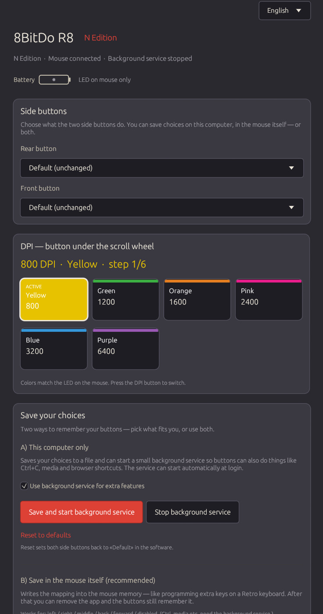

# 8BitDo R8 for Linux

[](Cargo.toml)
[](LICENSE)
[](https://kernel.org/)
[](https://archlinux.org/)
[](https://www.rust-lang.org/)

**Configure your 8BitDo Retro R8 mouse on Linux** - side buttons, DPI readout, save to mouse firmware, optional background remapper. No Windows Ultimate Software required (of cause not...)

Official Ultimate Software is Windows-only. Most Linux 8BitDo tools target **keyboards**. This project is for the **R8 mouse only**.

Languages in the GUI: English (default), Dansk, Deutsch, Svenska, Norsk.

## Screenshot



## Why this exists

Other Linux tools (for example [8bitdo-linux](https://github.com/paulocezarvjr/8bitdo-linux)) map **keyboards**. They do not configure the Retro R8 **mouse**.

`r8-rs` fills that gap:

| Feature | This project | Typical keyboard-only tools |
|---------|--------------|-------------------------------|
| Remap R8 side buttons | Yes | No |
| Save mapping into mouse firmware | Yes | No |
| Live DPI stage readout | Yes | No |
| Software remap (Ctrl, media, browser) | Yes (daemon) | Keyboard-focused |
| GUI | Yes (`r8-gui`) | Varies |

## What this is

Rust workspace under `r8-rs/` (version **1.0.0**):

| Piece | Purpose |
|-------|---------|
| `r8-gui` | Settings app (egui) |
| `r8d` | Optional user daemon for non-hardware actions |
| `r8-core` | Shared HID + config + i18n |
| `packaging/install.sh` | Build + install to `~/.local` + systemd user unit |

2.4 G adapter (USB ID `2dc8:5206`) required for configuration. Battery % is not exposed by the mouse over this link (LED on the mouse only).

## Quick start

```bash
cd r8-rs
./packaging/install.sh
r8-gui
```

Needs: Rust toolchain, `hidraw` access to the adapter (often a udev rule or being in the right group).

Uninstall (does **not** wipe firmware maps in the mouse):

```bash
./packaging/uninstall.sh
```

## Save in the mouse

1. Pick mouse actions (left / right / middle / back / forward / disabled)
2. Click **Save in mouse settings**
3. Mapping lives in firmware - you can uninstall the app and keep the maps

Ctrl / media / browser shortcuts still need the background service.

## Repo layout

```
r8-rs/
  crates/r8-core/   # HID, config, translations
  crates/r8-gui/    # Settings GUI (egui)
  crates/r8d/       # Background remapper daemon
  packaging/        # install / uninstall scripts
  assets/           # README screenshot
```

Source only - no compiled binaries in the repo. Build with `cargo` or `./packaging/install.sh`.

## Author

- **Name**: Michael Bay Sørensen
- **Website**: [mbsTECH.dk](https://mbstech.dk)
- **Twitter**: [@baysorensen](https://twitter.com/baysorensen)
- **GitHub**: [mbs1337](https://github.com/mbs1337)

## License

GPL-3.0 [http://www.gnu.org/licenses/gpl-3.0.html](http://www.gnu.org/licenses/gpl-3.0.html)
